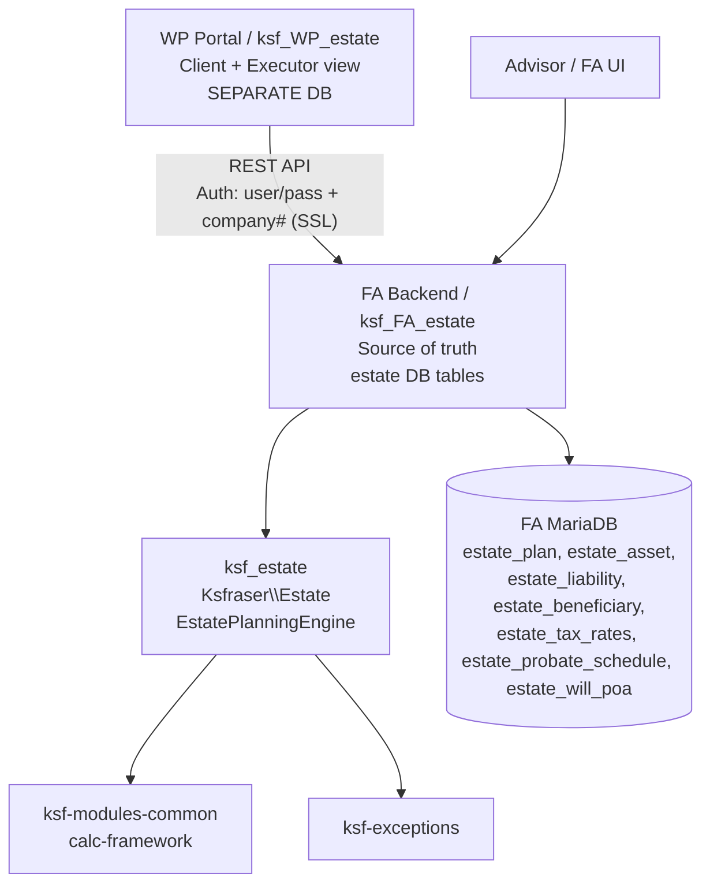
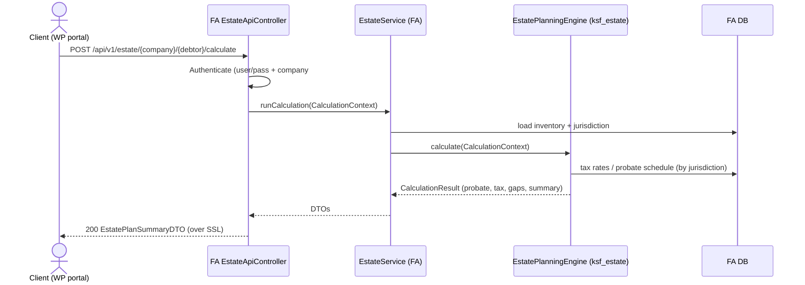

# Estate Planning — Design (PMBOK Phase 2)

**Module:** ksf_estate (canonical business-logic package, PSR-4 `Ksfraser\Estate`)
**Status:** Engines built and ported into `ksf_estate`; deployment = wire into FA module + WP portal per the WP-portal / FA-backend architecture.
**Related:** `ksfii_app` aggregator `Integration_Requirements.md` (AR-001..008); `PersonalRecordsOrganizer` (EPM) record-locator.

## 1. Architecture Overview (current truth)

- `ksf_estate` is the **single canonical** estate business-logic package.
  - Engines: `EstatePlanningEngine` (implements `CalculationEngineInterface`), `EstateTaxCalculator`, `ProbateFeeLookup`, `BeneficiaryAnalysisEngine`, `WealthTransferOptimizer`.
  - Depends on `ksf-modules-common` (calc-framework: `CalculationEngineInterface`, `CalculationContext`, `CalculationResult`, `ParameterDefinition`, `ValidationRuleInterface`, `ValidationResult`) and `ksf-exceptions` (`Ksfraser\Exceptions\Domain\CalculationException`).
  - PDO-backed; jurisdiction-aware (`estate_tax_rates`, `estate_probate_schedule` keyed by jurisdiction).
- Consumed by **both** the FA module (`ksf_FA_estate`) and the WP portal (`ksf_WP_estate`) via Composer → identical math on both sides (AR-004). **No math is re-implemented in WP.**
- The external `ksf_EstatePlanning` (US-tax, mis-scoped) repo is **retired**; its non-contradictory test structure / RTM approach is salvaged into `ksf_estate`. Tax logic stays Canadian (`Ksfraser\Estate`), jurisdiction-gated for any future non-CA extension (FR-001-005).

## 2. Deployment Topology

- **WP portal** (`ksf_WP_estate`): a separate, self-hosted server with its **own database**. User-entered data is stored locally, then pushed to FA via REST API. FA is the source of truth (except freshly user-entered data).
- **FA backend** (`ksf_FA_estate`): owns the estate DB tables, runs the `ksf_estate` engines, and exposes the REST API.
- Each client = an FA company (`debtor_no`); all data segregated per company (multi-tenant, no cross-client leakage).

## 3. UML — Component & Message Passing

## 4. DTOs (message contracts)

- `EstateInventoryDTO`: `debtor_no`, `jurisdiction`, `assets[]`, `liabilities[]`, `beneficiaries[]`, `will_date`, `poa_date`, `document_locations[]` (FR-001-003).
- `ProbateEstimateDTO`: `estate_value_subject_to_probate`, `fee`, `blended_rate`, `schedule_ref` (FR-001-001).
- `TaxEstimateDTO`: `rrif_rrsp_included`, `cap_gains_tax`, `total_final_return_tax`, `tax_year` (FR-001-002).
- `EstatePlanSummaryDTO`: `inventory`, `probate`, `tax`, `gaps[]`, `executor_timeline` (48-60-6, FR-001-008), `wealth_transfer_aids[]` (FR-001-011), `stale_flags[]` (FR-001-009), `jurisdiction` (FR-001-005).

## 5. Persistence (DAO / ActiveRecord)

- **FA DB** (system of record): `estate_plan`, `estate_asset`, `estate_liability`, `estate_beneficiary`, `estate_tax_rates`, `estate_probate_schedule`, `estate_will_poa`.
- **WP DB** (separate): mirrors user-entered `estate_plan` rows locally; syncs to FA via the API. Never shares a DB with FA.
- Use FA/WP built-in DB methods (DTO/DAO/ActiveRecord pattern, FA 2.4.19). PDO is used only inside `ksf_estate` engines (already PDO-backed).
- Jurisdiction-aware: `estate_tax_rates` and `estate_probate_schedule` are keyed by jurisdiction; Canadian (federal + provincial) is the default (FR-001-005).

## 6. API Contract (WP↔FA REST)

| Method | Path | Purpose |
|--------|------|---------|
| POST | `/api/v1/estate/{company}/{debtor}` | Upsert inventory (FR-001-003) |
| GET | `/api/v1/estate/{company}/{debtor}` | Fetch plan |
| POST | `/api/v1/estate/{company}/{debtor}/calculate` | Run engine → Probate/Tax/Summary DTOs |
| GET | `/api/v1/estate/{company}/{debtor}/summary` | Fetch compiled summary (FR-001-004) |

- Auth: **Username/Password + FA company number** (AR-003); RBAC enforces advisor vs client view (FR-001-006). All over SSL.
- The same engine runs in FA for the advisor view, so both roles use identical math.

## 7. Shared Math Interface

- `EstatePlanningEngine implements CalculationEngineInterface` → `calculate(CalculationContext): CalculationResult`.
- **Jurisdiction strategy**: a `TaxRate` service selects federal/province rates from `estate_tax_rates`; default = Canada; non-Canadian logic only when jurisdiction is explicitly set (FR-001-005). Never silently overrides Canadian defaults.
- Validation via `ksf-modules-common` `ValidationRuleInterface` / `ValidationResult`; domain errors throw `CalculationException`.

## 8. Genuine Gaps to Build (TDD)

From the original engine inventory, two CFP topics have **no engine**:
1. **Debt Management** engine — debt payoff / cash-flow impact on estate.
2. **Charitable Giving / Bequest** engine — donation strategies, receipting, estate reduction.

Additional FR-driven work (mostly assembly/presentation, not new solvers):
- Executor 48-60-6 timeline presentation (FR-001-008).
- Wealth-transfer / estate-freeze aids (FR-001-011): flags for corporate freeze, LCGE, life insurance role, Alter Ego/Joint Partner trusts, blended-family/intestacy risk — planning aids, not legal advice.
- Two-view RBAC (FR-001-006) and LLM assistant skills (FR-001-007) live at the FA/WP service layer, not in `ksf_estate` math.
- Full unit-test coverage (TDD) for every engine method + the new gaps (target 100%).

## 9. PersonalRecordsOrganizer (EPM) relationship

EPM is the executor-facing **record locator** ("where are the will/deeds/accounts/passwords"). Under the WP-portal model this is delivered by the WP portal client/executor view (`ksf_WP_estate`); EPM can be merged into or kept complementary to it. The estate plan summary links to record locations captured in FR-001-003/004 so the advisor/client meeting has both the *numbers* and the *where-the-papers-are*.

## 10. Technology Constraints

- **PHP 7.3** (NO 7.4+ syntax: typed properties, arrow functions, etc.).
- **FA 2.4.19** + WordPress; business logic only in `ksf_estate` (generic Packagist package).
- Process: **PMBOK** — Requirements → Design → TDD. Practices: DI/DRY/SOLID/SRP, unit tests + PHPDoc, keep `AGENTS.md` updated in each repo.
